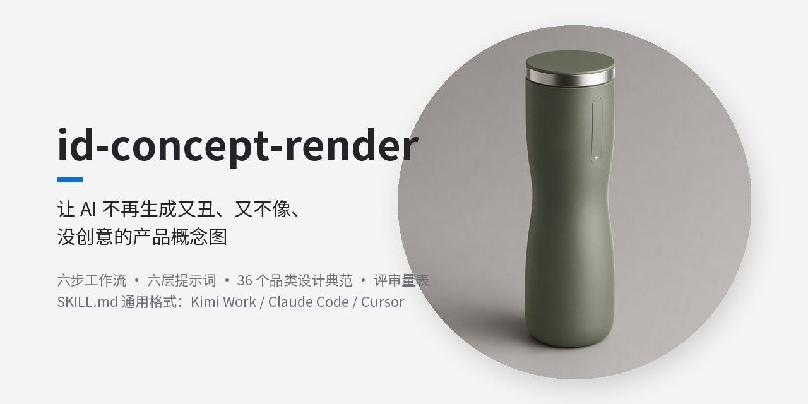
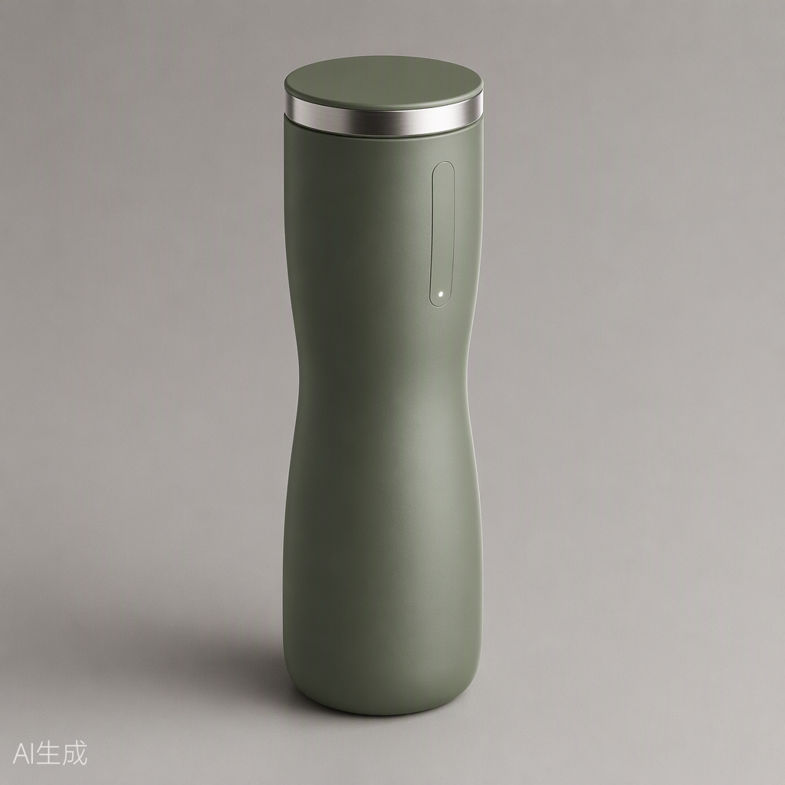

<div align="center">

# id-concept-render

**让 AI 不再生成又丑、又不像、没创意的产品概念图**

[](LICENSE)
[](SKILL.md)

</div>



一个通用的 **AI 工业设计（ID）概念渲染 Skill**：不管 Kimi、Claude Code 还是 Cursor，任何能加载 `SKILL.md` 的 Agent 装上它，就能按"审美先行、结构保真、创新有据"的方法出产品概念图——而不是把 `beautiful, premium, 8k` 丢给模型听天由命。

## 为什么你需要它

直接用文字让 AI 出产品渲染图，典型结果是：**又丑（审美平庸）、又不像（乱加屏幕按键）、没创意（通用模板脸）**。

根因不是模型不行，是把审美、保真、创意三件事全压在一次生成上。本 Skill 把它们拆成可执行、可评审、可迭代的六步工作流：

```
① Brief 解构（模糊需求→引导式提问；详细描述→列假设）
② 定审美方向（形态语言先行，禁止空泛形容词）
③ 六层提示词（主体→形态→CMF→结构→光影→构图）
④ 批量生成（一次 2–4 张选底稿）
⑤ 量表评审迭代（五维打分 + 结构强检清单，强制 ≥2 轮）
⑥ 创新变体（形态/CMF/结构/交互四层面创新方法库）
```

## 仓库里有什么

| 文件 | 内容 |
|---|---|
| `SKILL.md` | 六步工作流主文件（Agent 加载入口） |
| `references/aesthetics.md` | 7 种形态语言体系、设计奖项共性、CMF 审美原则 |
| `references/design-exemplars.md` | **按 8 大品类分类的 36 个设计典范**（每类附可直接迁移的提示词短语） |
| `references/prompt-framework.md` | 六层提示词模板 + 词汇速查 + 否定约束短语库 + 正反例对比 |
| `references/accuracy.md` | 六类翻车模式对策、结构错误强检清单、保真清单 |
| `references/innovation.md` | 四层面创新方法库 + 方向描述模板 |
| `references/cost-dfm.md` | 工艺成本阶梯、按售价倒推外壳预算、低成本高级感手段、穿戴产品专项 |
| `references/intake-questions.md` | 渐进式需求访谈剧本：5 轮 13 个选项式问题，专治"不知道怎么说" |

## 示例输出

用 skill 自带的六层提示词正面例（smart water bottle）一次生成：



> 对比反面写法 `A beautiful futuristic smart water bottle, high-end, 8k, ultra detailed` 的效果差异，见 [references/prompt-framework.md](references/prompt-framework.md) 的正反例分析。

## 快速开始

按你用的 AI 类型选一条路径：

### A. 命令行 AI 一键安装（Codex / Claude Code / Cursor / Kimi Work）

让 AI 自己装——直接把下面这句发给它：

> 执行这条命令帮我安装一个 skill：`curl -fsSL https://raw.githubusercontent.com/Allen-Chen-coder/id-concept-render/main/install.sh | bash`（Windows PowerShell 用 `irm https://raw.githubusercontent.com/Allen-Chen-coder/id-concept-render/main/install.ps1 | iex`）

脚本会自动探测 Kimi Work、Claude Code、Cursor 的 skills 目录，装完即可用。也可以自己在终端跑这两条命令，效果相同。

### B. 命令行 AI 手动安装

```bash
git clone https://github.com/Allen-Chen-coder/id-concept-render.git
```

然后把文件夹放进 AI 的 skills 目录：

| AI | skills 目录 |
|---|---|
| Kimi Work（Windows） | `%APPDATA%\kimi-desktop\daimon-share\daimon\skills\` |
| Kimi Work（macOS） | `~/Library/Application Support/kimi-desktop/daimon-share/daimon/skills/` |
| Claude Code | `~/.claude/skills/` |
| Cursor | `~/.cursor/skills/` |
| 其他 Agent | `~/.config/agents/skills/` 或项目内 `.agents/skills/` |

### C. 网页版 AI 免安装（Gemini / ChatGPT / Kimi 网页版等）

网页 AI 不能跑本地命令，直接把 skill 文件喂给它：

1. **下载**：仓库首页 → 绿色 `Code` 按钮 → `Download ZIP`，解压得到 `id-concept-render-main` 文件夹
2. **上传**：新开一个对话，把 `SKILL.md` 和 `references/` 下的全部 7 个 `.md` 文件一起上传（Gemini / ChatGPT 都支持多文件上传；文件太多可分两批）
3. **发指令**：

   > 请完整阅读 SKILL.md，它是你的工作流程说明书；references 文件夹里的 7 个 md 是它的配套参考资料。从现在起，我让你生成产品概念渲染图时，请严格按 SKILL.md 的流程执行，需要参考资料时优先从你已读到的内容里取。读完请只回复"已就绪"。

4. **之后正常使用**：直接描述你的产品需求即可，它会先走提问/确认流程再出图

**进阶（Gemini 用户）**：把第 3 步的内容粘进 [Gems](https://gemini.google.com/gems) 的自定义指令里，references 按需贴入，skill 就永久生效，不用每次上传。

> ⚠️ 注意：网页版 AI 的出图能力取决于平台本身（Gemini 可直接生图，ChatGPT 需有图像生成权限）；SKILL.md 中的评审迭代方法在任何能出图的 AI 上都有效。

然后直接说：

> "帮我生成一个 XX 产品的概念渲染图"

模糊需求会被引导式提问补齐；带着详细描述或 PRD 来则直接解构出图。

## 特色

- 🎯 **审美可执行**：形态语言库把"好看"翻译成可写进提示词的词汇，杜绝 `beautiful/premium` 式空话
- 🧱 **保真有清单**：结构逐一点名 + 否定约束短语库，抑制乱加屏幕按键的结构幻觉
- 💡 **创新有方法**：70% 熟悉 + 30% 陌生的边界规则，四层面创新方法各配提示词切入示例
- 💰 **成本有档位**：批量生产场景按售价倒推外壳预算，低成本不等于廉价（蚀纹/分型线/单点金属）
- 🗂️ **品类有典范**：36 个公认设计标杆按品类归档，跨品类迁移即创新来源

## 贡献

欢迎补充品类典范（`references/design-exemplars.md` 的"未覆盖品类"规则）、新的翻车模式对策、你的使用案例。提 Issue 或 PR 均可。

## License

[MIT](LICENSE)

---

# English Version

<div align="center">

# id-concept-render

**Stop AI from generating product concept renders that are ugly, off-brief, and clichéd**

[](LICENSE)
[](SKILL.md)

</div>


A universal **AI industrial design (ID) concept-rendering skill**: any agent that can load a `SKILL.md` file — Kimi, Claude Code, Cursor — gains a disciplined method for producing product concept images with taste, fidelity, and originality, instead of gambling on `beautiful, premium, 8k`.

## Why you need it

Text-to-render AI typically produces: **ugly** (generic aesthetics), **off-brief** (random screens and buttons), **uncreative** (template faces).

The root cause is cramming taste, fidelity, and creativity into a single generation. This skill splits them into a reviewable, iterable workflow:

```
1. Brief deconstruction (guided interview for vague asks; assumptions list for detailed ones)
2. Aesthetic direction first (form language before prompts; vague adjectives banned)
3. Six-layer prompts (subject → form → CMF → structure → lighting → composition)
4. Batch generation (2–4 variants, pick the best base)
5. Rubric-scored review loops (5 dimensions + structural checklist, ≥2 rounds enforced)
6. Innovation variants (form / CMF / structure / interaction method library)
```

## What's inside

| File | Content |
|---|---|
| `SKILL.md` | Six-step workflow (agent entry point) |
| `references/aesthetics.md` | 7 form languages, award-winner common traits, CMF principles |
| `references/design-exemplars.md` | **36 design exemplars sorted into 8 product categories**, each with copy-ready prompt phrases |
| `references/prompt-framework.md` | Six-layer prompt template + phrase bank + negative-constraint library + good/bad examples |
| `references/accuracy.md` | Six failure modes with fixes, structural error checklist, brief-fidelity checklist |
| `references/innovation.md` | Innovation methods across 4 layers + direction-pitch template |
| `references/cost-dfm.md` | Process cost ladder, casing budget back-calculated from retail price, low-cost premium tricks, wearable-specific rules |
| `references/intake-questions.md` | Progressive interview script: 13 option-based questions in 5 rounds, for users who "don't know where to start" |

## Sample output

Rendered in one shot with the skill's own positive example prompt (smart water bottle):


## Quick start

**A. One-line install for CLI agents (Codex / Claude Code / Cursor / Kimi Work)** — just send this message to the AI:

> Run this command to install a skill for me: `curl -fsSL https://raw.githubusercontent.com/Allen-Chen-coder/id-concept-render/main/install.sh | bash` (on Windows PowerShell: `irm https://raw.githubusercontent.com/Allen-Chen-coder/id-concept-render/main/install.ps1 | iex`)

The script auto-detects the skills directory of Kimi Work, Claude Code, or Cursor. You can also run the commands yourself in a terminal.

**B. Manual install for CLI agents**

```bash
git clone https://github.com/Allen-Chen-coder/id-concept-render.git
```

Then move the folder into your AI's skills directory:

| AI | Skills directory |
|---|---|
| Kimi Work (Windows) | `%APPDATA%\kimi-desktop\daimon-share\daimon\skills\` |
| Kimi Work (macOS) | `~/Library/Application Support/kimi-desktop/daimon-share/daimon/skills/` |
| Claude Code | `~/.claude/skills/` |
| Cursor | `~/.cursor/skills/` |
| Other agents | `~/.config/agents/skills/` or `.agents/skills/` in a project |

**C. Zero-install for web AIs (Gemini / ChatGPT / Kimi web, etc.)**

Web AIs can't run local commands — feed the skill files directly to them:

1. **Download**: repo homepage → green `Code` button → `Download ZIP`, and unzip
2. **Upload**: in a new chat, upload `SKILL.md` plus all 7 `.md` files under `references/` (Gemini / ChatGPT both support multi-file upload; split into two batches if needed)
3. **Send the instruction**:

   > Please read SKILL.md in full — it is your workflow manual; the 7 md files in the references folder are its supporting reference material. From now on, whenever I ask you to generate a product concept render, strictly follow the SKILL.md workflow, and draw on the reference material you have already read. Reply only "Ready" when done.

4. **Then just use it**: describe your product; it will interview/confirm before generating

**Pro tip (Gemini users)**: paste step 3 into a custom [Gem](https://gemini.google.com/gems) instruction to make the skill permanent — no re-upload needed.

> ⚠️ Note: image generation on web AIs depends on the platform itself (Gemini can render directly; ChatGPT needs image-generation access). The review-and-iterate method works on any AI that can produce images.

Then simply say:

> "Generate a concept render of a [product]"

Vague requests trigger the interview; detailed descriptions or PRDs go straight to deconstruction.

## Highlights

- 🎯 **Executable aesthetics**: a form-language vocabulary replaces empty words like `beautiful/premium`
- 🧱 **Fidelity checklists**: name every structure + a negative-constraint library to suppress hallucinated parts
- 💡 **Structured innovation**: the 70% familiar + 30% novel rule, with prompt-entry examples for each method
- 💰 **Cost-aware CMF**: casing budget back-calculated from retail price — cheap doesn't have to look cheap
- 🗂️ **Category-sorted exemplars**: 36 canonical designs to anchor style and to cross-pollinate for innovation

## Contributing

Contributions welcome: new category exemplars (see the "uncovered categories" rule in `references/design-exemplars.md`), new failure modes and fixes, and your usage cases. Issues and PRs are both fine.

## License

[MIT](LICENSE)
